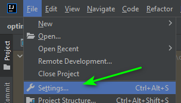
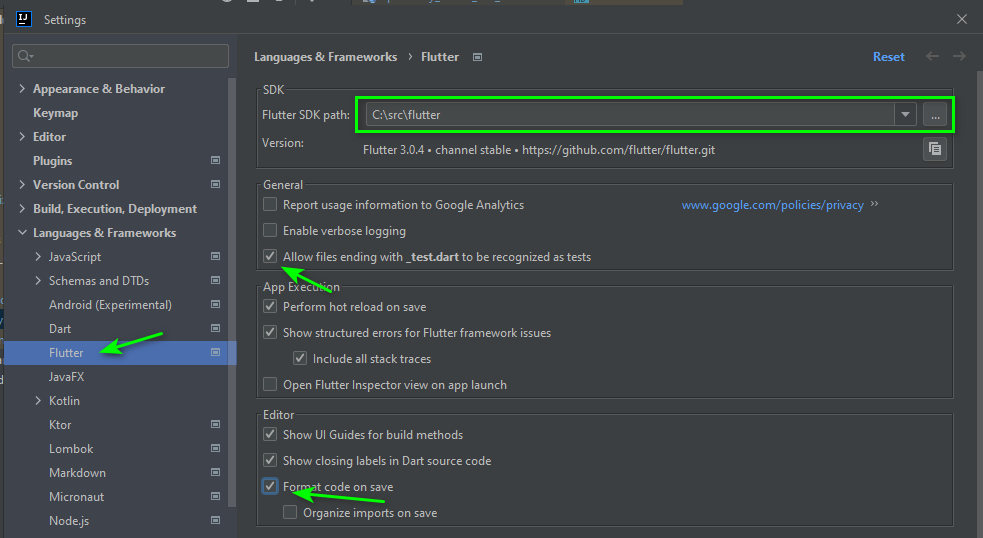
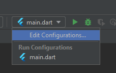
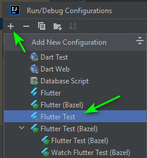
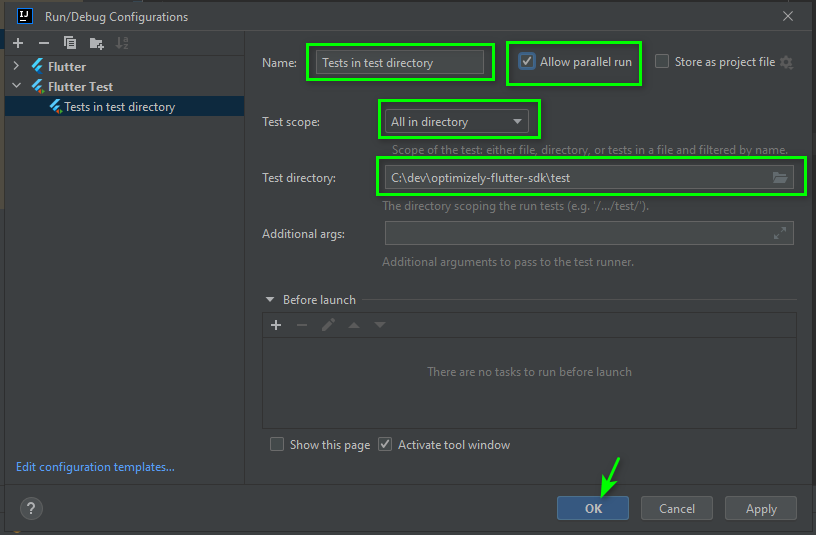

# optimizely_flutter_sdk

This project is a starting point for a Flutter
[plug-in package](https://flutter.dev/developing-packages/),
a specialized package that includes platform-specific implementation code for
Android and/or iOS.

## Getting Started

### Using the SDK
Refer to the [Flutter SDK developer documentation](https://docs.developers.optimizely.com/experimentation/v4.0.0-full-stack/docs/install-sdk-flutter) for instructions on getting started with using the SDK.

### Requirements

See the [pubspec.yaml](https://github.com/optimizely/optimizely-flutter-sdk/blob/master/pubspec.yaml) file for Flutter version requirements.

On the Android platform, the SDK requires a minimum SDK version of 21.

On the iOS platform, the SDK requires a minimum version of 10.0.

Other Flutter platforms are not currently supported by this SDK.

### Installing the SDK

To add the flutter-sdk to your project dependencies, include the following in your app's pubspec.yaml:

```
   optimizely_flutter_sdk: ^1.0.0
```

Then, import the package in your application code:

```
   import 'package:optimizely_flutter_sdk/optimizely_flutter_sdk.dart';
```

### Samples

A sample code for SDK initialization and experiments:

```
   var flutterSDK = OptimizelyFlutterSdk("my_sdk_key");
   var response = await flutterSDK.initializeClient();
```

### Development

1. [Install Dart](https://dart.dev/get-dart#install) for your platform.
2. Configure your IDE to point to the Dart SDK directory listed from the installation instructions. <br/> e.g. Windows: C:\tools\dart-sdk
3. [Install Flutter](https://docs.flutter.dev/get-started/install) for your platform.
*Note*: The download is big. Extract using an archive tool if needed. 
4. Ensure your PATH includes the `bin` directory of your Flutter installation. <br/> e.g. Windows: `C:\src\flutter\binC:\src\flutter\bin`
5. For users of IntelliJ, install the following plugins:
   1. Dart by JetBrains 
   2. Flutter by flutter.dev
6. In your IDE and in the path of this repo, open a terminal and run <br/>`flutter packages get`
7. For users of IntelliJ, configure Flutter settings
   1. Go to File > Settings...  
      
   2. Configure the Flutter SDK and additional settings  
      

## Testing in Terminal

1. To run [unit tests](https://docs.flutter.dev/cookbook/testing/unit/introduction) using terminal, simply use the following command:
`flutter test test/optimizely_flutter_sdk_test.dart`

## Testing In IntelliJ

1. Click Edit Configurations... in the Run/Debug configurations menu  
   
2. Click the + button and add a Flutter Test configuration  
   
3. Configure the settings for the test run  
   
4. Run the test suite to ensure correct settings  
   